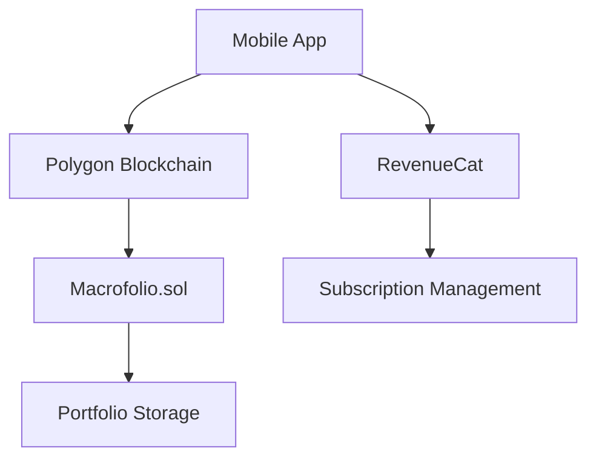

# Macrofolio 📊
**Blockchain-powered Investment Portfolio Tracker for Josh @VisualFaktory's Shipyard Brief**

[](https://opensource.org/licenses/MIT)
[](https://polygon.technology/)
[](https://www.revenuecat.com/)

## 🎯 Problem Statement
*Josh's investors juggle stocks, gold, funds, fixed income, real estate across multiple platforms — messy to track and hard to understand at a glance.*

## ✨ Solution
Macrofolio provides a unified, blockchain-based portfolio tracker where users can:
- Log investments across all asset classes
- Get real-time price updates via blockchain transparency
- Set alerts for non-listed products
- Access premium risk & diversification analysis

## 🚀 Live Demos
| Platform | Link | Status |
|----------|------|--------|
| 🌐 Web Demo | [macrofolio-app.vercel.app](https://macrofolio-app.vercel.app) | Live |

| 💼 Smart Contract | [amoy.polygonscan.com/address/0x7EF2...](https://amoy.polygonscan.com/address/0x7EF2e0048f5bAeDe046f6BF797943daF4ED8CB47) | Verified |
| 🔗 Polygon Amoy | Contract: `0x7EF2e0048f5bAeDe046f6BF797943daF4ED8CB47` | Deployed |

## 👨‍⚖️ For Judges
1. **🎥 Watch Demo Video** - [2-minute overview](https://youtu.be/5Fve86iO7BI)

3. **📝 Review Proposal** - [Full project documentation](https://drive.google.com/file/d/1EoO_7oegHr6JaR9cArDy03KXcJWlvvmC/view?usp=sharing)
4. **💻 Test Smart Contract** - [Interactive Remix IDE](https://remix.ethereum.org/#lang=en&code=YOUR_CODE)

## 📱 QR Code for Easy Access
  
Scan to access all links: [Linktree](https://linktr.ee/macrofolio)

## 🛠️ Technical Stack
- **Mobile**: React Native / Flutter
- **Blockchain**: Solidity, Polygon, Ethers.js
- **Backend**: Node.js, RevenueCat API
- **Monetization**: RevenueCat subscriptions (IAP)

## 🏗️ Architecture


## 📦 Installation
```bash
git clone https://github.com/nutraz/macrofolio.git
cd macrofolio
npm install
npm start
```

## 📄 License
MIT License - see [LICENSE](LICENSE) file for details

